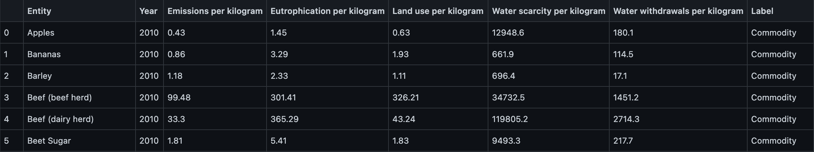
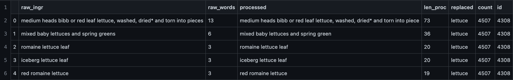
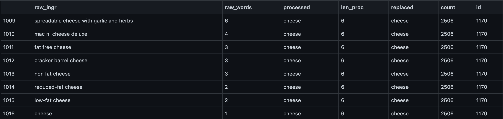
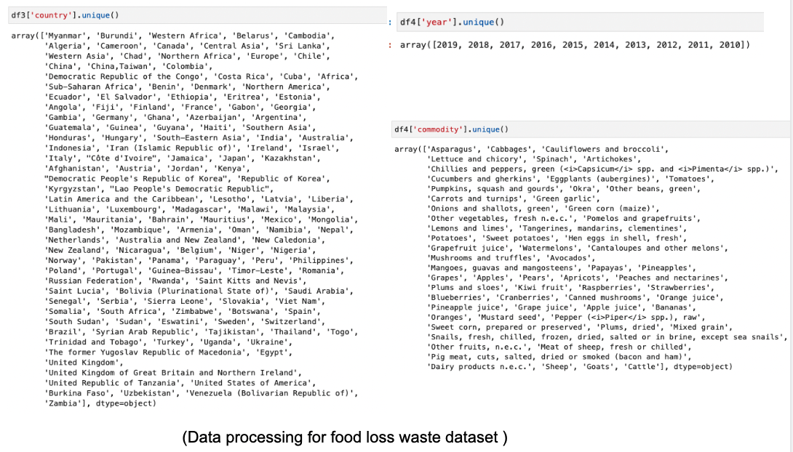
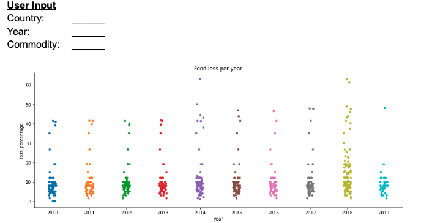
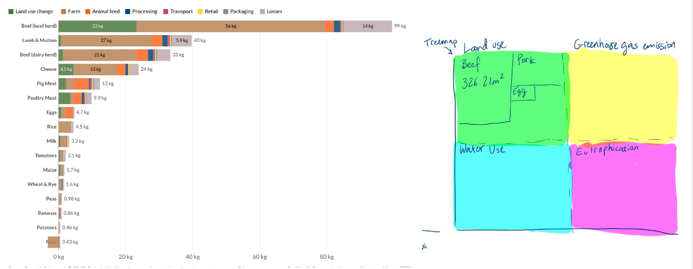
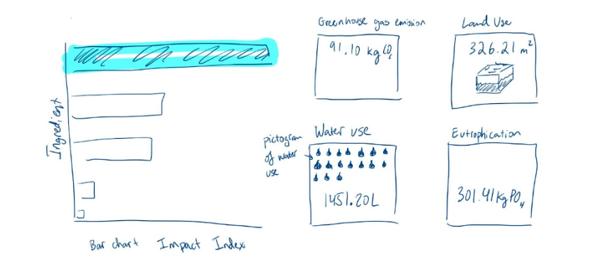
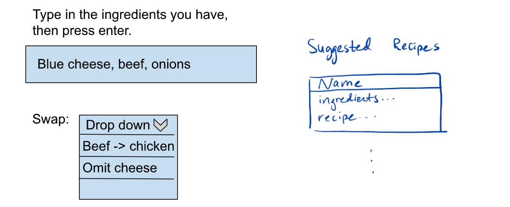
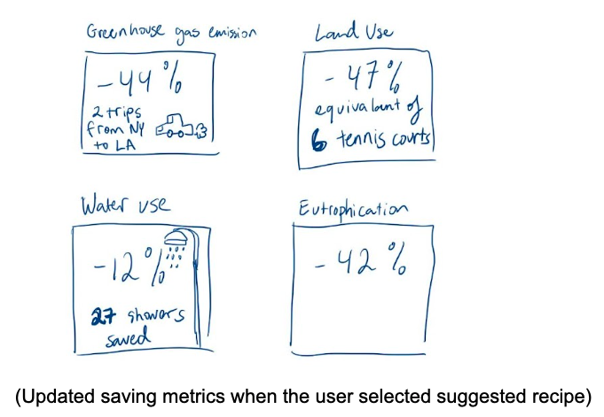
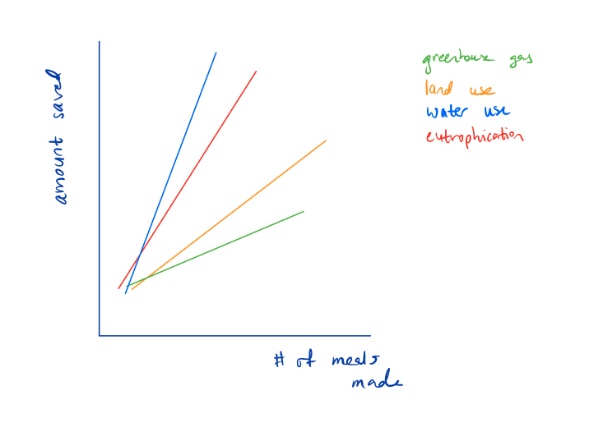

# Final Project Proposal

**GitHub Repo URL**: (https://github.com/CMU-IDS-Fall-2022/final-project-foodrescuers)

**Team**: Durvesh Vilas Malpure, Michael Van Buren, Neha Nishikant, Uyen Tran, & Abubakir Siedahmed

## How can we apply modern data science tools to help reduce food waste?

According to the United States Department of Agriculture (USDA), between 30 - 40 percent of the food supply in the US is wasted. This corresponds to about 133 billion pounds and $161 billion worth of food in 2010. This is not just a problem in the United States; one-third of food produced for human consumption is lost or wasted globally. This amounts to 1.3 billion tons annually, worth approximately $1 trillion. If wasted food were a country, it would be the world's third-largest producer of carbon dioxide, after the USA and China (“5 Facts about Food Waste and Hunger | World Food Programme”). We’d like to pose the following question, how can we do our part to best reduce food waste? To answer this question, we will develop an application that will allow people to make conscious decisions about the food they already have to reduce waste. We plan to provide an user interface where the user can input the ingredients they have at home, find popular recipes with those ingredients, and provide the most environmentally friendly dish they can make with their home ingredients. 

We plan to provide the user with visualizations regarding the carbon footprint of the food and the ingredients they consume. Specifically, we would like to show how different ingredients' footprints compare to each other. This part of visualization is a setup for our recipe recommender. To address the food waste problem , we plan to use the Environmental Impacts of Food dataset of the carbon footprint of food ingredients for the EDA section. The dataset includes other unique aspects, such as each ingredient's land and water use. We hope to create appealing and powerful visualizations to convey the gravity of the problem and the cost of food waste. Another type of visualization we would have is to highlight metrics about food waste such as most popular ingredients (provided in the introduction).

Based on the dataset of recipes and food waste, we are planning to use a similarity based model or a recommender system that will try to recommend dishes with a metric/loss that will focus on reducing the waste food. We plan to use features such as perishability, time of buying, expiry date, etc. Based on these models, we would recommend recipes that are possible with the available ingredients than what’s specified in the recipe. Along with this, we will develop a simple model that finds the carbon impact of store-bought foods and suggest what to buy that will be the most environmentally friendly while also trying to be economical. We can define the similarity based on textual embeddings and try to predict the recipe and its impact. We are considering using datasets such as the Recipe1M+ dataset for additional tasks.

Since our project aims to reduce the amount of food waste one person at a time, we will inform users of how much they’re saving and how much they will save. We believe that providing the user with a concrete number could motivate users to continue using our system. To calculate the waste avoided, we plan to sum the waste avoided for each ingredient which can be found by multiplying the carbon footprint of an ingredient per 100 grams. Once we have that, then we can calculate the waste avoided by the amount of that ingredient in the recipe. Lastly, we’ll forecast to the user the amount of waste avoided over a period of time depending on how often the user makes the dishes.

**Citations**: \
How we fight food waste in the US. Feeding America. (n.d.). Retrieved October 31, 2022, from https://www.feedingamerica.org/our-work/our-approach/reduce-food-waste \
“5 Facts about Food Waste and Hunger | World Food Programme.” Wfp.org, 2 June 2020, www.wfp.org/stories/5-facts-about-food-waste-and-hunger. Accessed 1 Nov. 2022. \
Recipe1M+: A Dataset for Learning Cross-Modal Embeddings for Cooking Recipes and Food Images, http://pic2recipe.csail.mit.edu/
“Data Explorer: Environmental Impacts of Food.” Our World in Data, Global Change Data Lab, 2018, https://ourworldindata.org/explorers/food-footprints. \

# Sketches and Data Analysis

## Data Processing
We don’t need to do any substantial data cleanup since there aren’t any null values in our dataset. However, we do need to do some preprocessing.

We have two main datasets.
1. Ingredient to environmental impact: [https://ourworldindata.org/explorers/food-footprints](https://ourworldindata.org/explorers/food-footprints) 
2. Recipe to ingredients dataset: [https://www.kaggle.com/datasets/shuyangli94/food-com-recipes-and-user-interactions?select=PP_recipes.csv](https://www.kaggle.com/datasets/shuyangli94/food-com-recipes-and-user-interactions?select=PP_recipes.csv) 

Firstly, Dataset 1 had 4 separate CSV files for each dimension of environmental impact (greenhouse gas emission, land use, water use, and eutrophication). We merged these 4 files together by row (where each row represents one ingredient) to create 1 CSV file. One quantity we derive from this dataset is a final index of environmental impact which is the sum of all 4 dimensions normalized by the max of that . We will show this quantity via a stacked bar chart.

(Image 1. Data processing for impact dataset)

Next we have to find a way to connect our 2 datasets. The raw recipes file has an ingredient list for each recipe. The ingredients don’t perfectly match the ingredients from Dataset1. For example, Dataset1 has the ingredient “cheese”. Dataset2 on the other hand has “blue cheese”, “cream cheese”, etc. Instead of creating an explicit mapping between the ingredients of the 2 datasets, we will use TF-IDF score where the selected ingredients from Dataset1 is the query and the ingredient lists for the recipes in Dataset2 are the docs. We will use TF-IDF scores to retrieve the highest scoring recipes to recommend to the user. We use cosine similarity to find similar ingredients or recipes similar to an ingredient list.

(Image 2. Data processing for recipe dataset)

(Image 3. Data processing for recipe dataset)

We also have an additional dataset for some preliminary narrative visualizations: https://www.fao.org/platform-food-loss-waste/flw-data/en/ 
Pre-processing will include the country, commodities, and the years list from the dataset. 

(Image 4. Data processing for food loss waste dataset)

## System Design

**Narrative**:

We want to introduce the user to the problem of food waste by showing the user how much food their home country wasted since the time they were born. Users will be able to select their country of interest, Year(s) they are interested in, and commodity to see the loss percentage of food for each year for the commodities they are interested. The graphic below will filter baked on the user input to show the percentage of commodities that were lost for each country within the given time period. 

(Image 5. Narrative screen)

**Main Visualization:**

The main visualization will have side by side charts. On the left hand side, there will be a stacked bar chart that’s broken down by category of land use, water use, Eutrophication and greenhouse gas emission per ingredient. Each bar will show an Impact Index, which indicates the total amount of environmental impact across all types by a weight factor. On the right hand side, there will be a tree map as shown in the picture below.

When the user click on one or more ingredients on the left chart, the charts on the right will change to be like so, where the right hand side shows the combined metrics for all selected ingredients:

(Image 6. Main visualization default screen)

When the user click on one or more ingredients on the left chart, the charts on the right will change to be like so, where the right hand side shows the combined metrics for all selected ingredients:

(Image 7. Bar select screen)

The selected ingredient will be highlighted. The charts on the right will show the different metrics of the impact of that ingredient, along with pictograms of visualizations to convey the amount of the metric.

**Solution:**
Further, we allow the user to type in whatever ingredients they have. We use the TF-IDF idea to map the typed-in ingredients to the recipes and also the the ingredients in Dataset1. The retrieved recipes dynamically show up on the right. 

For interactivity, the impact visualizations above are modified by the user input. 
For example, if the user inputs “blue cheese”, that gets mapped to recipes that show up on the side and also gets mapped to “cheese” in the Dataset1 so the “cheese” bar gets highlighted on the above impact visualizations. Below show sketches for the solution section, which would sit below the stacked bar chart visualizations.

(Image 8. Recipe reccomender solution screen)

When the user chooses our suggested recipe/ ingredient to swap out (optional feature), we will show them metrics of how much they saved by providing them with concrete numbers of easy to visualize impact such as the amount of showers saved, or number of trips from NY to LA saved, or number of tennis courts saved for land use.

(Image 9. Updated saving metrics when the user selected suggested recipe)

We will also draw out linear charts that show (for each metric, in diff colors) the amount saved vs. # of meals made.

(Image 10. Charts showing saving metrics)

