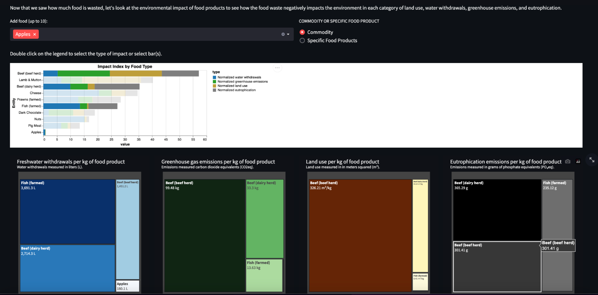

# CMU Interactive Data Science Final Project

## Title: Food Rescuers - How you can make an impact on food waste

* **Online URL**: https://cmu-ids-fall-2022-final-project-foodrescue-streamlit-app-ung2fe.streamlit.app/
* **Team members**:
  * dmalpure@andrew.cmu.edu
  * asiedahm@andrew.cmu.edu
  * mvanbure@andrew.cmu.edu
  * nnishika@andrew.cmu.edu
  * utran@andrew.cmu.edu
  
## Abstract
TODO

## Summary Image

## Work distribution

We distributed the work evenly and

Michael mainly worked on the introduction section.
Neha mainly worked on the global visualization section.
Jullia mainly worked on the treemap visualization section.
Durvesh and Abubakir mainly worked on the ML predictor.

However, we all helped each other with tasks and wrote the report together.

## Deliverables

### Proposal

- [ ] The URL at the top of this readme needs to point to your application online. It should also list the names of the team members.
- [ ] A completed [proposal](Proposal.md). Each student should submit the URL that points to this file in their github repo on Canvas.

### Sketches

- [ ] Develop sketches/prototype of your project.

### Final deliverables

- [ ] All code for the project should be in the repo.
- [ ] Update the **Online URL** above to point to your deployed project.
- [ ] A detailed [project report](Report.md).  Each student should submit the URL that points to this file in their github repo on Canvas.
- [ ] A 5 minute video demonstration.  Upload the video to this github repo and link to it from your report.
