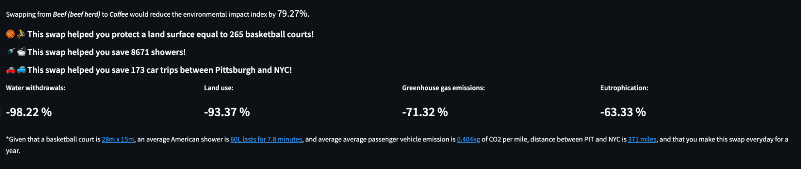

# Final Project Report

**Project URL**: TODO
**Video URL**: TODO

Short (~250 words) abstract of the concrete data science problem and how the solutions addresses the problem.

## Introduction
1.3 billion tons of food is wasted annually, worth approximately $1 trillion. Food waste occurs for a variety of reasons, including: uneaten food that is thrown out at homes and restaurants, crops left in fields because of low crop prices or too many of the same crops being available, problems during the manufacturing and transportation of food, and food not meeting retailers' standards for color and appearance (How we fight food waste in the US. Feeding America). 

According to the United States Department of Agriculture (USDA), between 30 - 40 percent of the food supply in the US is wasted. This corresponds to about 133 billion pounds and $161 billion worth of food in 2010. This is not just a problem in the United States; one-third of food produced for human consumption is lost or wasted globally. If wasted food were a country, it would be the world's third-largest producer of carbon dioxide, after the USA and China (“5 Facts about Food Waste and Hunger | World Food Programme”). We have developed an application that will allow people to make conscious decisions about the food they already have to reduce waste. We provide an interface where the user can input the ingredients they have at home, find popular recipes with those ingredients, and provide the most environmentally friendly dish they can make with their home ingredients.
Our project enables everyday consumers to better understand the scope of food waste, and how they can do their part to reduce that waste.

Note (for the grader): Due to Streamlit server issue, sometimes the “Find recipes” button might error out or take a really long time to load. Normally, it should only take about half a minute for the results to show up. There is a progress bar. If the button stopped working, reloading the site should work. Running this app offline is more reliable in our experience.

## Related Work

**Data Visualizations of food waste around the world:**
	
One of the best sources to see food waste around the world is from the Food and Agriculture Organization (FAO) of the United Nations. The FAO aggregates data from “700 publications and reports from various sources (e.g., subnational reports, academic studies, FAOSTAT and reports from national and international organizations such as the World Bank, GIZ, FAO, IFPRI, and other sources), producing more than 50,000 data points to date” (“Food and Agriculture Organization of the United Nations”).
	
They provide data that can be broken down by year, geographic region and countries, commodities, and the value chain stage(s) in which the food was lost. Additionally, the FAO provides the method of data collection. This data can be viewed and downloaded on the FAO website (“Food and Agriculture Organization of the United Nations”).  In 2020, the FAO released 18,754 data points across 133 countries/regions. In November 2021, the FAO aggregated more than 29,000 data points. 
	
Data visualizations from the FAO served as inspiration to our visualizations allowing users to contextualize the problem of food waste around the world. 
  
**Recipe recommendation based on input ingredients:**

There are several recipe recommendations. Yummly (https://www.yummly.com) is a site that recommends recipes based on user inputs such as allergy, cooking level skills, and style of dishes. This style of recommendation is quite different from what we implemented since we didn’t take into account dish style or allergy. Pantry (https://www.supercook.com/#/desktop) is another site that also recommends recipes. This site lets the user select the ingredients that they have per category of food type such as “Pantry Essentials”. This is slightly different from what we implemented in the sense that it doesn’t allow for full text entry, but more of a search and select each ingredient. Our implementation allows for ease of use since it uses a machine learning model to analyze the text and match the ingredients.

The Environmental Impacts of Food from the website (https://ourworldindata.org/environmental-impacts-of-food) has a visualization for the impact of food. However, they have a bar chart for each of the categories of impact so there ended up being 5 different bar graphs.

## Methods

**Introduction:**

To set up our data to make insightful visualizations, we wanted to include information about each country per year. This required some data processing of the dataset from the Food and Agriculture Organizations of the United Nations (FAO dataset). In order to visualize our data geographically, we needed to connect our data to an altair geodataset. The typical way of doing so requires a join on country ID, where the ID comes from the ISO 3166 codes. Thus, we first grouped our data by country and year and performed several aggregations including record count, loss average, and most lossy commodity. Then we cleaned the countries. We dropped year-country-commodity duplicates and took the record with the highest loss. We also had to clean the country column to match the ISO 3166 codes; for example “United States of America” became “United States”. Then we joined our data with the ISO 3166 code data before then joining that on the altair geodata.

To contextualize the impact of food loss around the world, we give an opportunity for users to input the year and country they were born, or in which they are interested. Once a user populates this information, we show the largest food loss item for that year and a map displaying the food loss average globally. Food loss is further broken down within a country by the commodity type. 

An example of this would be a user selecting that they were born in, or interested in, food loss in 2003 for the United States. The user would then be presented with information showing the top ten commodities with the highest loss percentage (percentage of a food produced that was lost) - that includes more than 40% of grapefruit, pineapple, and orange juices lost of that produced for 2003 in the US. Ideally, this gives a user an opportunity to reflect on what ingredients they have in their fridge / pantry, and what they are actually consuming. 

A user can also see the average loss percentage of food around the world for a given year. On average, their country may be better or worse than the world. We considered a few different metrics before settling on average. First we tried summing the total loss over all commodities for a given country-year pair, but this misrepresented countries that simply had more data. Thus, an average loss metric seemed most fair. 

**EDA:**

*Data processing:*

The provided dataset (Our World in Data | Environmental Impacts of Food) has multiple categories of impact: greenhouse gas emissions, land use, eutrophication, water scarcity and water withdrawals. We chose to focus on the four impact categories of greenhouse gas emissions, land use, eutrophication, and water withdrawals. One of the issues we faced was that these categories each have different units and so when we overlay them through a stacked bar chart, not all of the categories show up equally. To overcome this, we create columns for the normalized value of the impact. For example, each greenhouse gas emission of an ingredient will be divided by the highest emission in an ingredient. This ratio is then summed across the four categories and normalized to a scale of 100 to create what we call the impact index. This index is what we used to rank the impact of each of the ingredients, for ease of comparison between the food products.

To contextualize the food impact of the recipes, we provided the user some metrics for their choices of recipes if they switch from the recipe with the highest impact index to lowest impact from the recommended recipes. To contextualize the impact, we quantify the amount of saving through concrete context. For example, for land use, we find the difference in land use impact between the two recipes, then divide this difference by the number of basketball courts area and multiply this by 365 to find the amount of basketball courts saved, assuming if the user makes this change in recipe every day for a year. The links for these metrics are provided on the application.

*Interface techniques:*

To visualize the impact of the ingredients, we use multi-view coordination between the stacked bar chart and a treemap. This multi-view is between the Plotly treemap component and the Altair stacked bar chart component. Because of the differences in library, multi-view capability needed an additional plug in for it to work since Altair brush selection is purely a front-end event. The plug in captures the select event of the user and equates that to the data the user selected. The selected data is passed out as a click event dictionary from the Altair chart. This event dictionary is then used to filter the dataset with the user inputs and be fed into the Plotly treemap. The stacked bar chart shows the aggregate impact of a food ingredient, broken down by the category of impact. This stacked bar chart is a multi-select bar chart, where there are color highlights for the selected bar. When the bars are selected, the tree map would adjust to show the impact value of the selected commodities and be displayed. This way the user can easily compare between commodities both the aggregate impact, and within each impact category.

*ML:*

We used one of the datasets that can be found in the Data Explorer: Environmental Impacts of Food as one of our sources. After downloading the data, we were presented with six datasets. These datasets were later combined into one dataset and used as the basis for the main impact visualization that was developed using that dataset. Unfortunately, we could not use this dataset to calculate grams. We searched the internet for a dataset in which grams could be calculated, but most of the datasets we found did not include any columns for fruits or measurements. A number of datasets also had a very small number of fruit entries in their fruit column, and this was a serious problem. Having scoured the internet for quite a while to find the right data, we finally decided to combine two datasets: food and food_portion, in order to achieve our goal. It is important to note that the first dataset had ample amounts of fruit values, whereas the second dataset had measurements of fruits. The inner join was used to join the datasets based on their ID column, and following this, we had to do several data cleaning such as removing duplicates and missing values from the dataset. It was this process that enabled us to produce a useful dataset which allowed us to calculate the gram.

Our goal with this project was to get the best recipes and the most relevant recipes and their impact on the environment for a particular user. There are many existing recipe recommendation systems online or as independent projects. But we approached this task with a perspective to reduce the impact on the environment. Along with the recipe, we also calculated the impact the recipe can cause on the environment with different factors such as carbon emissions, water use, land use, etc. We then visualized these factors and the comparison of the recipes on our website. 
We firstly needed to find the dataset for recipe recommendation such that we could make use of it and recommend the best recipe for a user’s requirements. The food.com recipe dataset on kaggle is a large collection of recipes and their respective attributes such as the ingredients, their nutritional value, the instructions, the time it takes to cook, etc. This dataset was well aligned with our project because of its simplicity of use in a CSV file. The actual dataset contains more than 230 thousand recipes and rich attributes for all the recipes. To use this dataset for our project, we determined that using the ingredients would give us the most accurate results for a recipe.

We take in a list of ingredients available to a particular user and try to find the recipes in a dataset that contains similar ingredients. Rather than asking the user to think about what they should eat, we make the task easier for the user by just asking them the ingredients in their kitchen or refrigerator. The main challenge with this task was to find the closest matches of a recipe given the ingredients. This is a text matching task that can be dealt with using many methods such as using large language models or just trying to see which recipe has all the ingredients we have. We realized that this is not feasible as the ingredients may differ in their names drastically such as different types of cheeses. 

To overcome this, we used the TF-IDF technique. TF-IDF uses the frequency of a word in a document as well as the frequency of that word occurring in all the documents to encode the document. Initially, we convert the ingredient list in the dataset to a raw string without any commas and preprocess it such that it removes the unnecessary closing and opening square brackets (‘[‘ and ‘]’) . We store these TF-IDF encodings for every recipe’s ingredients so that we can use it later when an input of ingredients is provided. Subsequently, when a user provides the ingredients in their inventory, we find its TFIDF encoding and then use cosine similarity to find the recipes that have the most similar ingredients. We find the top 5 recipes that have the most cosine similarity amongst all the recipes. 

Once we have the recipes, for every recipe, we calculate the impact it can cause on the environment in terms of the same factors provided in the main dataset. We face some issues in this approach. Particularly, the unavailability of the portion sizes of each ingredient in that recipe. The impact metrics available in the main dataset are per kilograms of that item. Thus, to overcome this, we used a different dataset from the U.S. Department of Agriculture that contained the information about the different portion sizes of various types of items available in stores. This contains items such as a particular brand’s hummus as well as regular hummus. We realized that using this dataset would be quite helpful for this task as we will be able to take in not just generic names of ingredients but also of various brands. Once we get the standard portion size of an ingredient, we just scale the impact of that item from the original dataset i.e. 10 grams of bacon will have 1/100th of the impact as the one caused by a kilogram of bacon. Once we get the scaled impact, we just add together the impact for the standard portions of every ingredient. 

Additionally, another important aspect of the recipe recommendation and impact calculation is the Levenshtein distance calculation for string matching. This is a string matching metric that calculates the number of updates to a string to convert it to the second string. Two exact same strings will have a Levenshtein distance of 0 whereas two strings such as apples and green apples will have a distance of 6. We use this to find the closest matching item in our datasets given an ingredient. This also helps us map the ingredients in the food portion dataset to the food impact dataset.

## Results

*Introduction:*

In our introduction, we motivate and contextualize our problem. The United States specifically has a lot of data within the FAO dataset and most of our audience is from the United States, thus we chose to highlight it in our first visualization. We wanted the introductory visualization to be personalized to the user, thus we ask the user to input the year they were born. The bar chart on the right then renders to get the Top 10 “worst” commodities, i.e the commodities with the worst loss in the U.S for that year. The user can also mouse over the bars to show tooltips of the commodity and the loss percentage. The number one worst commodity is highlighted below.

We then pivot to a bigger picture view and show food loss across the globe. On the top, the user can select as many countries as they’re curious about and a year between 1970 and 2015. The bar chart on the left will then render a window of time of a decade with the selected date in the middle to show the number of lossy commodities for a given year aggregated across the selected countries. Interestingly, hovering over a bar shows a tooltip feature for the worst commodity for the given year and selected countries. The scatter plot below the bar chart also renders, but instead of showing the number of commodities, plots exact commodities against their respective loss. By hovering over a dot, the tooltip shows the country, year, and exact loss percentage. The user can also select bars on the bar chart to accordingly filter the scatter plot. 

Our third graph in this visualization shows a choropleth global map of the average loss percentage across all commodities for a given country and selected year. We chose to balance the interactive bar and scatter plots with the choropleth to help contextualize and make our visualizations more concrete.

EDA:

Our decision to use treemaps was inspired from the A Study on the Effectiveness of Tree-Maps as Tree Visualization Techniques paper where the researchers recruited participants to compare four types of treemaps. Their findings compelled us to use treemaps to visualize our data because of their ability to illustrate the analysis of a large hierarchical structure in an extremely clear and concise manner. A treemap is presented in the form of a rectangle to represent each node, and for those nodes that have child nodes, these rectangles are divided into smaller rectangles in order to represent those child nodes. A good reason to have this capability is so that there will be less information on one node, and the user will not be overwhelmed by too much information available to them. We chose the original treemap to visualize our data because although there are many types of treemaps, such as circular treemaps, cushion treemaps, and 3D treemaps, it is a very appealing form of displaying hierarchical information compared to other types of treemaps. Furthermore, by using a variety of colors and sizes of rectangles, it is possible to help the viewer differentiate the importance of different values. Due to the fact that circular treemaps use circles instead of rectangles, we decided against using them. We also decided not to use the 3D tree-map option because we didn't want to visualize our data in a 3D layout but rather in 2D.

On default, this page will view the top 10 highest impact index by food type of food products. The user is able to use the selector to select commodities they are interested in. The user will also be able to switch between Commodity or Specific Food Products. Selecting the bars will highlight for the stack bar chart view, and change the view of the treemaps as to now only contain the selected commodity. This will allow the user to compare between the food products the user selected.

Additionally, double clicking on the legend (specific legend type) would allow the user to switch to this view for the stack graph.

We want users to be motivated to stop food waste. Thus we project some metrics that show how much they could save over time if they remain consistent. First, we compare metrics of the worst (most lossy) and best (least lossy) commodity in the bar chart from Fig 3. In the example below it’s beef and coffee. We give metrics for the impact a user could make if they stopped buying and wasting beef and compare these metrics to tangible things like showers.

*ML*:
The last section of our app encourages users to be an active part of the solution. They can input their ingredients and the TF-IDF model outputs the top 5 recipes in detail for those ingredients along with their environmental impacts. Lastly, we show another metric-driven visualization to highlight the differences between the most and least lossy recipes from the top 5. 

Users may enter five ingredients present in their refrigerator in the textbox and click on the Find recipes button to generate recipes that contain those ingredients. After this has been done you will be able to see a horizontal stacked bar chart showing their 5 ingredients. As with the horizontal stacked bar chart described in the above section, this stacked bar chart will serve the same purpose by displaying the impact index by food type. To aid the user in being able to understand the impact of the food type, a treemap has also been added.

As a result of the TF-IDF model, under the tree maps, you will see a breakdown of the top five recipes for each of the five ingredients. There is no doubt that this model is very effective as it will facilitate user efficiency and save the planet at the same time. As opposed to the user having to go to the internet to find a recipe that uses the ingredients they currently have, the model will automatically provide the user with multiple recipes that will match those ingredients. Furthermore, the model also offers to the user several recipes from which they can choose. By adding this feature, we are hoping to encourage the user to eat from the ingredients that they already have instead of going out to eat or purchasing items that they do not need.

As an added feature, we also provide the user with a way to view how much environmental impact they are contributing to by swapping recipes. From the example below, if the user swaps from cheesy pizza macaroni to Carmen Jackson's Swedish eggs rara, then they are able to reduce the environmental impact index by 76.72%. Considering our potential diverse users have a variety of educational and knowledge background, we have added additional content to translate the 76.72% impact into something that is more relatable to their day-to-day lives in order to make the 76.72% impact more meaningful. An example would be that by swapping the recipes the user has contributed to the preservation of the land surface equivalent to four basketball courts. Another example as a result of the swap, eight car trips between Pittsburgh and New York City were saved.

## Discussion

*Introduction:*

Through the choropleth map, the user can see how their country compares to the average across the past few decades. One unsurprising observation is the increase in data as the years become more recent. For example, in 1990, only three countries had food loss data. This is comparable for the years prior as well. On the other hand, in 2015, there are a few dozen countries with data and the choropleth map is thus more insightful. Another observation from this map is that the United States’ food loss was generally consistent from 2000-2015, with a slight gradual increase. This trend isn’t surprising and should and can motivate us to make a difference to stop the rise of food waste.

*EDA:*

As discussed in the Results section, the stack bar chart gives the user insights to the top ten commodities that have the highest impact index.  Some insights the user gains from the stack bar chart is that big mammals like cows and lamb are at the top of this chart, followed by their products such as cheese and dairy products from cows. Following this category are prawns and fish. This pattern is important to make note, as it’s a set up for the insights discussed below.

Through the tree map, the user can compare per category of impact which commodity is more detrimental (land use, water use, greenhouse gas emissions, and eutrophication emission). In the freshwater withdrawals, it’s interesting to see that farmed fish and farmed prawns are actually not in the first and second place. Instead, cheese and nuts are what withdraws the most liter of water per kg of these food products. For greenhouse gas emissions, it’s interesting to see dark chocolate is in second place just after beef for its emission. For land use, it’s interesting to see that lamb and beef are much more costly than the rest of the categories. It’s surprising that fish (farmed), and prawns (farmed) are actually at the bottom of this chart even though they were high on the water withdrawals chart. The eutrophication graph isn’t quite as surprising as the other graphs in that beef, fish, prawns and lambs all take the top categories, so this trend is very similar to the one we see with the stack charts.

Furthermore, when the user selects multiple charts, they will see insights about how swapping between the top and bottom costs or save on environmental impact. The insights will compare a swap between the most costly commodity with the least costly from the selected commodities. As the default, this swap is between Beef (beef herd) and coffee, which will decrease the environmental impact index by 79.27%, protect a land surface equal to 265 basketball courts, save 8671 showers, and save 173 car trips between Pittsburgh and NYC. These insights are contextualized, as basketball courts for land use, instead of providing the user a number such as 111,300 meter squared which is a lot harder for an average user to imagine and find meaning in this number.

*ML:*

Similar to the commodity section, the recipes section also allows the user to notice some trends and compare the impact between different recipes. The user can gain insights on which recipe consumes the highest impact overall or per category. With these insights, for example, the user with ingredients in their fridge to make these 5 recipes might choose to make cheesy pizza macaroni since it’s the one that has the most environmental impact. This is because the ingredients in this high impact recipe if not used would contribute to food waste, which since this recipe has the highest impact index would mean that it’s the most detrimental to the environment. However for future grocery trips, the user can maybe think about choosing a less environmental impact recipe like cheese omelet. The list of ingredients for each recipe is listed in our app, which will make their shopping trips easier and more informative.

Furthermore, insights between recipe swaps are also provided and are contextualized. These insights help the user be more encouraged to perform a recipe swap in the future.

## Future Work

*Introduction:*

Future work that could be done to expand the Introduction section would include adding additional data points. It is evident the bulk of data is in developed countries. It would be beneficial to expand the study by funding research in developing countries. Additionally, there are challenges quantifying food loss from households who dispose of food that was not consumed because it spoiled. It would be beneficial to conduct studies to ensure estimates across household waste is as accurately as possible. 

The biggest gap today is the need to be published more broadly. Currently, everyday consumers are given information regarding nutrition and diet. Data around food waste could easily be incorporated into consumer outreach out diet and nutrition, and corporate training on alternatives to disposing of food. Additionally, In the US, most businesses dispose of good food because it doesn’t sell to consumers quick enough. They dispose of this food because they (incorrectly) believe there is a potential liability. Spreading awareness of the Emerson Good Samaritan Act, which shields donors and recovery organizations from criminal and civil liability arising from the age, packaging or condition of donated food could reduce food waste from disposal in the US (while helping those in need).

This project is just the start of an outreach program that could spread awareness of food waste around the world and what everyday consumers, and businesses, could do to reduce their part. 
	
*EDA:*

Future works of the insights sections, besides providing the insights of food ingredients and the recipe swap, we could also provide insights of being able to switch specific ingredients out from a recipe and seeing the insights of saving from this switch. This way, the user can know if they switch from a specific ingredient to another in a recipe that our site recommended, they can find out about the environmental impact for this action.

*ML:*

Future work for prediction could be to also allow the user to input how much of each ingredient they have to account for measurements. Currently, our model doesn’t take into account the spelling mistakes that could be commonly caused by a user. We also only map the ingredients using a TFIDF encoding and its cosine similarity with the other recipes’ ingredients. This could be done in a better way with more compute available using deep learning models to parse the ingredients provided by users.

Further,  we could make the interface more intuitive by offering natural language input, instead of a structured input. For example, a user could input “I have three eggs and red bell peppers” instead of input “eggs peppers”. This would allow for more expressive inputs and an easier interface for the user. To parse this, we would need a more sophisticated NLP model to parse and understand the natural language input.

